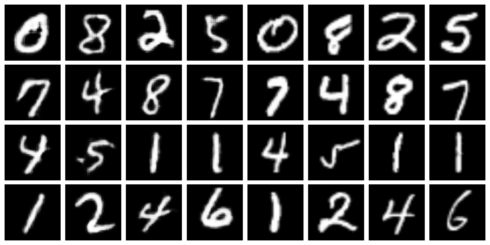

# Conditional Generative Adversarial Network (CGAN) - MNIST

This repository contains a Conditional Generative Adversarial Network (CGAN) implementation trained on the MNIST dataset. The CGAN generates images based on a given class label, allowing the generation of specific handwritten digits.

## Datasets Used
- **MNIST**: A dataset of 60,000 handwritten digits, where each image is labeled with its corresponding digit class.

## Model Description

The CGAN architecture consists of two main components:

1. **Generator**: The generator network takes random noise and a class label as input and generates an image corresponding to the specified class. It uses transposed convolutional layers to upsample the input noise and class embedding into the desired image size.

2. **Discriminator**: The discriminator network evaluates whether a given image is real (from the dataset) or fake (produced by the generator), while also considering the class label associated with the image. It uses convolutional layers and class embedding to provide a probability that the image is real.

### Architecture Details
- **Generator**:
  - **Input**: Random noise vector and class label.
  - **Layers**: Transposed convolutional layers with batch normalization and ReLU activation.
  - **Output**: Image with dimensions matching the MNIST dataset (28x28).

- **Discriminator**:
  - **Input**: Image from dataset or generated by the generator, and class label.
  - **Layers**: Convolutional layers with instance normalization and LeakyReLU activation.
  - **Output**: Probability indicating whether the image is real or fake.

## Sample Results
Some generated samples from each epoch are displayed below:
NOTE : The left 4 x 4 squares represent the original images and the right 4 x 4 half represent the fake images generated based on the codition that they have the same class as the original in the left.

- **Epoch 1**:  
  

- **Epoch 2**:  
  

- **Epoch 3**:  
  

- **Epoch 4**:  
  

- **Epoch 5**:  
  

## How to Run

1. **Clone the Repository:**
   ```bash
   git clone https://github.com/Ganesh2609/CGAN.git
   cd CGAN

2. **Run the `test_CGAN.ipynb`**: Execute the notebook to generate synthetic images based on class labels. Each time the code runs, it generates different images corresponding to the class labels provided.
